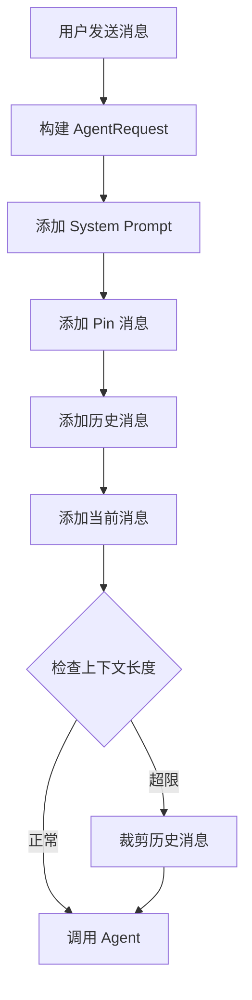

# skill-context-management.md

## 概述

本文档描述上下文管理机制，包括聊天历史如何传递给 Agent、上下文裁剪策略、以及 Pin 消息功能。

---

## 上下文组成

Agent 调用时的上下文由以下部分按顺序组成：

```
1. Agent System Prompt（固定）
2. Pin 的关键消息（优先）
3. 最近 N 条聊天历史
4. 当前用户消息
5. 当前 Artifact 摘要（如有）
```

### 各部分说明

| 部分 | 说明 | 是否固定 |
|---|---|---|
| System Prompt | Agent 的系统提示词 | 是 |
| Pin 消息 | 用户手动 Pin 的关键消息 | 否，可动态调整 |
| 历史消息 | 最近 N 条对话（默认 20 条） | 否，按时间裁剪 |
| 当前消息 | 用户刚发送的消息 | 是 |
| Artifact 摘要 | 大型 Artifact 的摘要信息 | 否，仅大文件使用 |

---

## 上下文传递流程



---

## 上下文裁剪策略

### 裁剪规则

| 策略 | 说明 | 触发条件 |
|---|---|---|
| recent-first | 优先裁剪最老的消息 | 上下文超过限制 |
| pin-first | Pin 消息永远保留 | 任何裁剪场景 |
| summarize-old | 老消息压缩为摘要 | 极端情况下 |

### 实现示例

```java
public List<Message> buildContext(Long conversationId, int maxMessages) {
    List<Message> context = new ArrayList<>();

    // 1. 添加 Pin 消息（永远保留）
    List<Message> pinnedMessages = getPinnedMessages(conversationId);
    context.addAll(pinnedMessages);

    // 2. 添加最近消息
    List<Message> recentMessages = getRecentMessages(conversationId, maxMessages);
    context.addAll(recentMessages);

    // 3. 按时间排序
    context.sort(Comparator.comparing(Message::getCreatedAt));

    // 4. 如果超过限制，从最老的非 Pin 消息开始裁剪
    if (context.size() > maxMessages) {
        List<Message> unpinned = context.stream()
            .filter(m -> !m.isPinned())
            .collect(Collectors.toList());

        int toRemove = context.size() - maxMessages;
        for (int i = 0; i < toRemove && !unpinned.isEmpty(); i++) {
            context.remove(unpinned.get(i));
        }
    }

    return context;
}
```

---

## Pin 消息机制

### Pin 消息规则

- 用户可以 Pin 任意消息
- Pin 消息会优先进入 AgentRequest
- Pin 消息在 UI 上有特殊标识
- 每个会话最多 Pin 10 条消息

### Pin 消息 API

```java
// Pin 消息
POST /api/messages/{messageId}/pin
Response: { "pinned": true }

// Unpin 消息
DELETE /api/messages/{messageId}/pin
Response: { "pinned": false }

// 获取 Pin 列表
GET /api/conversations/{conversationId}/pinned
Response: { "messages": [...] }
```

### Pin 消息数据结构

```java
public class Message {
    // ... 其他字段
    private boolean pinned;           // 是否 Pin
    private Long pinnedAt;            // Pin 时间
    private Long pinnedBy;            // Pin 操作人
}
```

### Pin 消息 UI 展示

```jsx
<MessageItem message={message}>
  {message.pinned && (
    <div className="pin-indicator">
      <Icon name="pin" /> Pinned
    </div>
  )}
</MessageItem>
```

---

## 上下文大小限制

### 限制策略

| 模型 | 最大上下文 tokens | 建议消息条数 |
|---|---|---|
| GPT-3.5 | 4K | 15-20 条 |
| GPT-4 | 8K / 32K | 20-50 条 |
| Claude 3 | 200K | 100+ 条 |
| DeepSeek | 32K / 128K | 50-100 条 |

### Token 估算

```java
public int estimateTokens(String text) {
    // 粗略估算：中文约 2 字符 = 1 token，英文约 4 字符 = 1 token
    return text.length() / 3;
}
```

### 超限处理

```java
public void validateContext(AgentRequest request, int maxTokens) {
    int totalTokens = estimateTokens(buildContextText(request));

    if (totalTokens > maxTokens) {
        // 递归裁剪直到符合限制
        while (totalTokens > maxTokens && request.getHistory().size() > 5) {
            request.getHistory().remove(0); // 移除最老的消息
            totalTokens = estimateTokens(buildContextText(request));
        }
    }
}
```

---

## Artifact 上下文策略

### 小型 Artifact

直接传递完整内容：

```json
{
  "type": "CODE",
  "content": "console.log('hello')",
  "language": "javascript"
}
```

### 大型 Artifact

只传摘要和引用：

```json
{
  "type": "FILE",
  "title": "large-file.txt",
  "size": "2.5MB",
  "summary": "包含 10000 行代码，主要功能是...",
  "reference": "artifact_block:12345"
}
```

---

## 验收检查清单

- [ ] 消息历史能正确传递给 Agent
- [ ] Pin 消息在上下文中优先保留
- [ ] 上下文超限时能自动裁剪最老消息
- [ ] Pin 消息有 UI 标识
- [ ] 大型 Artifact 只传摘要不传全文
