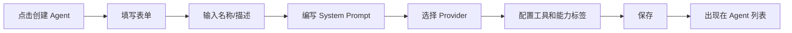

# skill-custom-agent-create.md

## 概述

本文档描述用户自建 Agent 的开发规范，包括 Agent 字段定义、创建流程、和前端交互。

用户可以通过表单或对话方式创建自定义 Agent，配置 System Prompt、选择底层模型和可用工具。

---

## 适用场景

- 用户希望创建个性化的 AI Agent
- 用户希望定义特定领域的专家 Agent
- 用户希望为不同任务创建不同的 Agent

---

## Agent 字段

| 字段 | 类型 | 必填 | 说明 |
|---|---|---|---|
| name | String | 是 | Agent 名称 |
| avatar | String | 否 | 头像 URL |
| description | String | 否 | Agent 描述 |
| systemPrompt | String | 是 | System Prompt |
| provider | String | 是 | 底层 Provider (DEEPSEEK/MINIMAX/OPENAI/ANTHROPIC) |
| model | String | 否 | 模型名称（可空时使用 Provider 默认） |
| capabilityTags | List | 否 | 能力标签 |
| tools | List | 否 | 可用工具列表 |
| visibility | String | 否 | 私有(PRIVATE) / 公开(PUBLIC) |
| enabled | Boolean | 是 | 是否启用 |

### capabilityTags 示例

```json
["code-generation", "code-review", "debugging", "documentation", "refactoring"]
```

### tools 示例

```json
["bash", "read_file", "write_file", "grep", "glob"]
```

---

## 创建流程

### 前端流程



### API 调用

```javascript
// 创建 Agent
POST /api/agents
{
  "name": "代码审查员",
  "description": "专注于代码质量和安全审查",
  "systemPrompt": "你是一个代码审查专家...",
  "provider": "DEEPSEEK",
  "model": "deepseek-v4-flash",
  "capabilityTags": ["code-review", "security"],
  "tools": ["bash", "read_file"],
  "visibility": "PRIVATE",
  "enabled": true
}
```

### 前端表单组件

```jsx
// AgentForm.jsx
const AgentForm = ({ agent, onSubmit }) => {
  const [form, setForm] = useState({
    name: agent?.name || '',
    description: agent?.description || '',
    systemPrompt: agent?.systemPrompt || '',
    provider: agent?.provider || 'DEEPSEEK',
    model: agent?.model || '',
    capabilityTags: agent?.capabilityTags || [],
    tools: agent?.tools || [],
    visibility: agent?.visibility || 'PRIVATE',
    enabled: agent?.enabled ?? true
  })

  const handleSubmit = () => {
    onSubmit(form)
  }

  return (
    <form>
      <input
        label="名称"
        value={form.name}
        onChange={e => setForm({ ...form, name: e.target.value })}
      />
      <textarea
        label="System Prompt"
        value={form.systemPrompt}
        onChange={e => setForm({ ...form, systemPrompt: e.target.value })}
      />
      <select
        label="Provider"
        value={form.provider}
        onChange={e => setForm({ ...form, provider: e.target.value })}
      >
        <option value="DEEPSEEK">DeepSeek</option>
        <option value="MINIMAX">MiniMax</option>
        <option value="OPENAI">OpenAI</option>
        <option value="ANTHROPIC">Anthropic</option>
      </select>
      {/* ... 其他字段 */}
    </form>
  )
}
```

---

## Agent 持久化

### 后端实体

```java
// Agent.java
@Entity
public class Agent {
    @Id
    @GeneratedValue(strategy = GenerationType.IDENTITY)
    private Long id;

    @Column(nullable = false)
    private String name;

    private String avatarUrl;

    @Column(columnDefinition = "TEXT")
    private String description;

    @Column(columnDefinition = "TEXT", nullable = false)
    private String systemPrompt;

    @Column(nullable = false)
    private String provider;  // DEEPSEEK, MINIMAX, OPENAI, ANTHROPIC

    private String model;

    @Column(columnDefinition = "JSON")
    private List<String> capabilityTags;

    @Column(columnDefinition = "JSON")
    private List<String> tools;

    @Column(nullable = false)
    private String visibility = "PRIVATE";  // PRIVATE, PUBLIC

    @Column(nullable = false)
    private Boolean enabled = true;

    @Column(nullable = false)
    private Long ownerId;

    private LocalDateTime createdAt;
    private LocalDateTime updatedAt;
}
```

### Mapper

```java
// AgentMapper.java
@Mapper
public interface AgentMapper extends BaseMapper<Agent> {
}
```

---

## Agent 列表和详情

### 获取 Agent 列表

```javascript
GET /api/agents
Response: {
  "data": [
    {
      "id": 1,
      "name": "Claude Code",
      "avatar": "...",
      "description": "...",
      "provider": "ANTHROPIC",
      "capabilityTags": [...],
      "ownerId": 1,
      "enabled": true
    }
  ]
}
```

### 获取单个 Agent

```javascript
GET /api/agents/{id}
Response: {
  "id": 1,
  "name": "Claude Code",
  "systemPrompt": "...",
  "provider": "ANTHROPIC",
  "model": "claude-3-haiku",
  "capabilityTags": [...],
  "tools": [...],
  "visibility": "PUBLIC",
  "enabled": true
}
```

---

## 更新和删除

### 更新 Agent

```javascript
PUT /api/agents/{id}
{
  "name": "新的名称",
  "systemPrompt": "新的 prompt",
  "enabled": false
}
```

### 删除 Agent

```javascript
DELETE /api/agents/{id}
// 需要验证 ownerId 是当前用户
```

---

## 与会话绑定

### 创建会话时选择 Agent

```javascript
POST /api/conversations
{
  "agentId": 1,
  "title": "与代码审查员的对话"
}
```

### Agent 被使用

用户创建带该 Agent 的会话后，该 Agent 出现在联系人列表：

```jsx
// SessionList 中展示
{agents.map(agent => (
  <AgentItem
    key={agent.id}
    agent={agent}
    onSelect={() => createSession(agent.id)}
  />
))}
```

---

## 权限控制

| 操作 | 权限 |
|---|---|
| 查看自己的 Agent | 始终可以 |
| 查看公开 Agent | 始终可以 |
| 创建 Agent | 登录用户 |
| 更新自己的 Agent | 所有者 |
| 删除自己的 Agent | 所有者 |
| 使用任何 Agent | 登录用户 |

---

## System Prompt 模板

### 代码助手

```
你是一个专业的代码助手，擅长：
- 代码生成和重构
- 代码审查和优化
- Bug 定位和修复
- 技术文档撰写

请始终提供清晰、可读的代码，并解释你的设计决策。
```

### 安全审查员

```
你是一个代码安全审查专家，专注于：
- 发现安全漏洞（SQL注入、XSS、CSRF等）
- 识别潜在的代码风险
- 提供修复建议

请详细说明每个问题的严重程度和修复方案。
```

### 技术文档专家

```
你是一个技术文档专家，擅长：
- 撰写清晰的 API 文档
- 编写用户手册和教程
- 创建代码注释和示例

请用简洁易懂的语言解释复杂概念。
```

---

## 验收检查清单

- [ ] 用户可以创建自定义 Agent
- [ ] 用户可以编辑自己创建的 Agent
- [ ] 用户可以删除自己创建的 Agent
- [ ] Agent 出现在新建会话的选择列表中
- [ ] 创建会话后可以与该 Agent 对话
- [ ] Agent 的 System Prompt 能正确传递给 AI
- [ ] 能力标签能正确保存和加载
