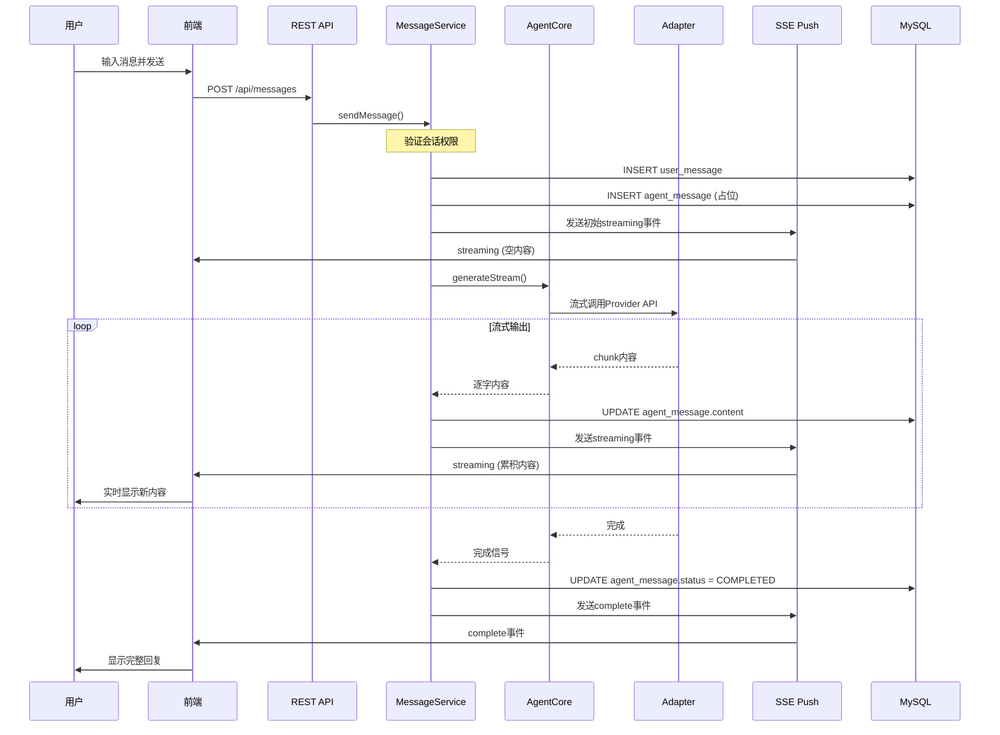

# skill-message-flow-dev.md

## 概述

本文档描述消息发送完整链路的开发规范，包括消息发送、持久化、Agent调用、SSE推送、前端更新。

---

## 消息状态机

| 状态 | 说明 | 触发时机 |
|---|---|---|
| PENDING | 消息已创建，等待处理 | 用户发送消息后 |
| STREAMING | Agent正在生成回复 | Agent开始流式输出 |
| COMPLETED | Agent回复完成 | 流式输出结束 |
| FAILED | Agent调用失败 | API错误或超时 |
| CANCELLED | 用户取消生成 | 用户主动中断 |

---

## 标准消息流程

### 1. 前端发送消息

```javascript
// ChatPage.jsx
const handleSendMessage = async (content) => {
  if (!currentSession) return
  await useMessageStore.getState().sendMessage(currentSession.id, content, null)
}

// messageStore.js
sendMessage: async (conversationId, content, parentId) => {
  const response = await messageApi.sendMessage(conversationId, content, parentId)
  get().addMessage(response.data)  // 添加用户消息
  return response.data
}
```

### 2. 后端接收并保存用户消息

```java
// MessageService.java
public MessageVO sendMessage(SendMessageRequest request, User sender) {
  // 1. 验证会话权限
  Conversation conversation = conversationMapper.selectById(request.getConversationId());

  // 2. 保存用户消息
  Message userMessage = new Message();
  userMessage.setConversationId(request.getConversationId());
  userMessage.setSenderType(SenderType.USER.name());
  userMessage.setSenderId(sender.getId());
  userMessage.setContent(request.getContent());
  userMessage.setMessageType(MessageType.TEXT.name());
  userMessage.setParentId(request.getParentId());
  messageMapper.insert(userMessage);

  // 3. 创建Agent占位消息
  Message agentMessage = createAgentMessage(request.getConversationId(), agentParticipant);

  // 4. 发送初始SSE事件
  sendStreamingUpdate(userId, agentMessage.getId(), "", agent);

  // 5. 异步调用Agent
  streamAgentResponse(userId, agent, agentRequest, agentMessage);

  return buildMessageVO(userMessage);
}
```

### 3. Agent调用流程

```java
// MessageService.streamAgentResponse()
private void streamAgentResponse(Long userId, Agent agent, AgentRequest request, Message agentMessage) {
  // 1. 获取对应Adapter
  AgentAdapter adapter = agentCore.getAdapter(agent.getProvider().toUpperCase());

  // 2. 构建Agent请求
  List<Message> history = getConversationHistory(conversationId, 20);
  agentRequest.setHistory(history);
  agentRequest.setTools(toolExecutor.getAvailableTools());

  // 3. 调用处理流程（支持工具调用循环）
  processWithToolLoop(userId, agent, request, agentMessage, adapter, emitter);
}
```

### 4. SSE推送机制

```java
// SSE事件类型
// 1. streaming - 流式更新
emitter.send(SseEmitter.event()
  .name("streaming")
  .data(messageVO));

// 2. complete - 完成
emitter.send(SseEmitter.event()
  .name("complete")
  .data(messageVO));

// 3. tool_call - 工具调用
emitter.send(SseEmitter.event()
  .name("tool_call")
  .data(eventData));

// 4. tool_result - 工具结果
emitter.send(SseEmitter.event()
  .name("tool_result")
  .data(eventData));
```

### 5. 前端SSE处理

```javascript
// useSSE.js
const connect = useCallback(() => {
  const eventSource = new EventSource(`/api/messages/subscribe?token=${token}`)

  eventSource.addEventListener('streaming', (event) => {
    const data = JSON.parse(event.data)
    onMessage({ type: 'streaming', data })
  })

  eventSource.addEventListener('complete', (event) => {
    const data = JSON.parse(event.data)
    onMessage({ type: 'complete', data })
  })
}, [])
```

### 6. 前端消息更新

```javascript
// ChatPage.jsx - handleSSEMessage
if (type === 'streaming') {
  setIsStreaming(true)
  const exists = currentMessages.some(m => m.id === data.id)
  if (exists) {
    updateMessage(data.id, { content: data.content })  // 更新现有消息
  } else {
    addMessage(data)  // 添加新消息
  }
} else if (type === 'complete') {
  setIsStreaming(false)
  updateMessage(data.id, { content: data.content })
  clearToolCalls(data.id)
}
```

---

## 完整时序图



---

## 关键实现点

### 1. 消息去重

前端通过消息ID去重，防止SSE重复推送导致消息重复：

```javascript
addMessage: (message) => set((state) => {
  if (!message || !message.id) return state
  const exists = state.messages.some(m => m.id === message.id)
  if (exists) {
    console.warn('Duplicate message prevented:', message.id)
    return state
  }
  // 按ID排序插入
  const newMessages = [...state.messages, message]
  newMessages.sort((a, b) => a.id - b.id)
  return { messages: newMessages }
})
```

### 2. 流式滚动策略

豆包式滚动：AI回复定位在窗口上方80px处：

```javascript
const scrollToStreamingMessage = useCallback((messageId) => {
  const container = messageListRef.current
  const messageEl = container.querySelector(`[data-message-id="${messageId}"]`)
  if (messageEl) {
    const containerRect = container.getBoundingClientRect()
    const targetTop = containerRect.top + 80  // 距顶部80px
    const messageRect = messageEl.getBoundingClientRect()
    const currentTop = messageRect.top - containerRect.top + container.scrollTop
    const scrollNeeded = currentTop - targetTop
    container.scrollBy({ top: scrollNeeded, behavior: 'auto' })
  }
}, [])
```

### 3. 工具调用循环

Agent支持多轮工具调用：

```java
private void processWithToolLoop(...) {
  do {
    // 1. 调用Agent获取响应
    AgentResponse response = adapter.generate(request);

    // 2. 检查是否有工具调用
    if (response.isHasToolCalls()) {
      // 执行工具
      for (ToolCall toolCall : response.getToolCalls()) {
        ToolExecutionResult result = toolExecutor.execute(toolCall);
        toolResults.add(result);
      }
      // 继续循环
    } else {
      // 最终回复，使用流式输出
      processFinalResponseWithStreaming(userId, agent, request, agentMessage, "");
      return;
    }
  } while (iterationCount < MAX_TOOL_CALLS);
}
```

---

## 错误处理

### 1. 后端错误处理

```java
// 发送错误事件
private void sendError(Long userId, String message) {
  SseEmitter emitter = activeEmitters.get(userId);
  if (emitter != null) {
    emitter.send(SseEmitter.event()
      .name("error")
      .data(Map.of("status", "FAILED", "message", message)));
  }
}
```

### 2. 前端错误展示

```javascript
if (type === 'error') {
  setError(data.message)
  setIsStreaming(false)
}
```

### 3. SSE断开重连

```javascript
// useSSE.js
eventSource.onerror = (error) => {
  eventSource.close()
  if (reconnectAttempts.current < maxReconnectAttempts) {
    const delay = Math.min(1000 * Math.pow(2, reconnectAttempts.current), 10000)
    reconnectTimeoutRef.current = setTimeout(() => {
      reconnectAttempts.current++
      connect()
    }, delay)
  }
}
```

---

## 验收检查清单

- [ ] 用户发送消息后，消息立即显示在列表中
- [ ] Agent回复使用流式输出，逐字显示
- [ ] AI回复时，消息定位在窗口上方80px处
- [ ] 流式过程中，用户上滑不会打断流式输出
- [ ] 用户上滑后，显示"回到底部"按钮
- [ ] 消息完成后，状态变为COMPLETED
- [ ] 网络断开后，SSE能自动重连
- [ ] 工具调用能正确执行并返回结果
