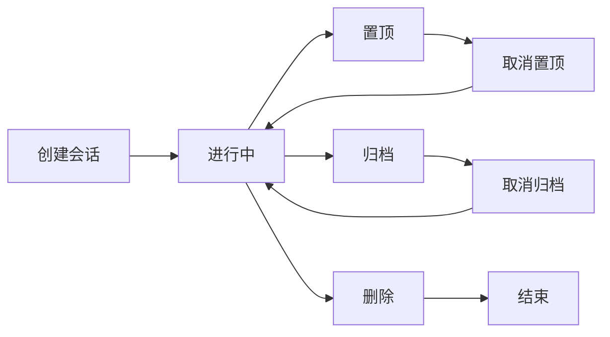

# skill-session-management.md

## 概述

本文档描述会话管理的开发规范，包括会话列表、新建会话、置顶/归档/搜索等生命周期功能。

---

## 会话能力矩阵

| 能力 | 优先级 | 说明 |
|---|---|---|
| 会话列表 | P0 | 显示用户所有会话 |
| 最近活跃排序 | P0 | 按最后消息时间排序 |
| 新建会话 | P0 | 选择 Agent 创建会话 |
| 删除会话 | P0 | 删除会话及关联消息 |
| 会话详情 | P0 | 查看会话信息和成员 |
| 会话置顶 | P2 | 置顶重要会话 |
| 会话归档 | P2 | 归档旧会话 |
| 会话搜索 | P2 | 搜索会话或消息 |
| 标题自动生成 | P1 | 基于首条消息生成标题 |
| 群聊成员管理 | P1 | 添加/移除 Agent |

---

## 会话类型

| 类型 | 说明 | 场景 |
|---|---|---|
| SINGLE | 单聊 | 用户与单个 Agent 1v1 对话 |
| GROUP | 群聊 | 用户与多个 Agent 同会话 |

---

## 数据模型

### conversation 表

| 字段 | 类型 | 说明 |
|---|---|---|
| id | BIGINT | 主键 |
| title | VARCHAR(200) | 会话标题 |
| type | VARCHAR(20) | SINGLE / GROUP |
| owner_id | BIGINT | 创建者用户 ID |
| created_at | DATETIME | 创建时间 |
| updated_at | DATETIME | 最后消息时间 |

### conversation_participant 表

| 字段 | 类型 | 说明 |
|---|---|---|
| id | BIGINT | 主键 |
| conversation_id | BIGINT | 会话 ID |
| user_id | BIGINT | 用户 ID（单聊时） |
| agent_id | BIGINT | Agent ID |
| role | VARCHAR(20) | OWNER / MEMBER |

---

## API 规范

### 获取会话列表

```javascript
GET /api/conversations
Response: {
  "data": [
    {
      "id": 1,
      "title": "与 Claude 的对话",
      "type": "SINGLE",
      "participants": [
        { "agentId": 1, "name": "Claude Code" }
      ],
      "lastMessage": {
        "content": "好的，我来帮你...",
        "createdAt": "2026-06-02T10:30:00Z"
      },
      "updatedAt": "2026-06-02T10:30:00Z"
    }
  ]
}
```

### 新建会话

```javascript
POST /api/conversations
{
  "agentId": 1,
  "title": "我的第一个 Agent 对话"
}
// or for group chat:
{
  "agentIds": [1, 2, 3],
  "title": "多 Agent 协作"
}
```

### 获取会话详情

```javascript
GET /api/conversations/{id}
Response: {
  "id": 1,
  "title": "与 Claude 的对话",
  "type": "SINGLE",
  "participants": [...],
  "messages": [...],
  "createdAt": "...",
  "updatedAt": "..."
}
```

### 更新会话

```javascript
PUT /api/conversations/{id}
{
  "title": "新的标题",
  "pinned": true,      // 置顶
  "archived": false     // 归档状态
}
```

### 删除会话

```javascript
DELETE /api/conversations/{id}
// 需要验证 owner_id 是当前用户
// 删除时会同时删除关联的 messages
```

---

## 前端实现

### SessionList 组件

```jsx
// SessionList.jsx
export default function SessionList({ sessions, onSelect, onNewSession }) {
  return (
    <div className="w-64 bg-gray-800 h-full">
      <div className="p-4">
        <button onClick={onNewSession} className="w-full btn-primary">
          + 新建会话
        </button>
      </div>

      <div className="space-y-1 px-2">
        {sessions.map(session => (
          <SessionItem
            key={session.id}
            session={session}
            onClick={() => onSelect(session)}
          />
        ))}
      </div>
    </div>
  )
}

// SessionItem.jsx
function SessionItem({ session, onClick }) {
  return (
    <div
      onClick={onClick}
      className={`p-3 rounded cursor-pointer ${
        session.pinned ? 'bg-blue-900/30' : 'hover:bg-gray-700'
      }`}
    >
      <div className="flex items-center justify-between">
        <span className="font-medium truncate">{session.title}</span>
        {session.pinned && <PinIcon />}
      </div>
      <div className="text-xs text-gray-400 truncate">
        {session.lastMessage?.content}
      </div>
      <div className="text-xs text-gray-500 mt-1">
        {formatTime(session.updatedAt)}
      </div>
    </div>
  )
}
```

### 新建会话 Modal

```jsx
// NewSessionModal.jsx
function NewSessionModal({ agents, onClose, onSubmit }) {
  const [selectedAgent, setSelectedAgent] = useState(null)

  return (
    <div className="fixed inset-0 bg-black/50 flex items-center justify-center">
      <div className="bg-gray-800 rounded-lg p-6 w-96">
        <h2 className="text-lg font-medium mb-4">新建会话</h2>

        <div className="space-y-2 mb-4">
          {agents.map(agent => (
            <div
              key={agent.id}
              onClick={() => setSelectedAgent(agent)}
              className={`p-3 rounded cursor-pointer border ${
                selectedAgent?.id === agent.id
                  ? 'border-primary-500 bg-primary-900/30'
                  : 'border-gray-600 hover:border-gray-500'
              }`}
            >
              <div className="font-medium">{agent.name}</div>
              <div className="text-xs text-gray-400">{agent.description}</div>
            </div>
          ))}
        </div>

        <div className="flex justify-end gap-2">
          <button onClick={onClose} className="btn-secondary">取消</button>
          <button
            onClick={() => onSubmit(selectedAgent)}
            disabled={!selectedAgent}
            className="btn-primary"
          >
            创建
          </button>
        </div>
      </div>
    </div>
  )
}
```

---

## 会话排序逻辑

### 最近活跃排序（默认）

```javascript
// 后端排序
const sessions = await ConversationMapper.selectList({
  where: { ownerId: userId },
  orderBy: 'updated_at DESC'
})
```

### 置顶优先 + 最近活跃

```javascript
const sessions = await ConversationMapper.selectList({
  where: { ownerId: userId, archived: false },
  orderBy: 'pinned DESC, updated_at DESC'
})
```

---

## 会话生命周期



---

## 删除会话处理

删除会话时必须同时删除关联数据：

```java
@Transactional
public void deleteConversation(Long conversationId, Long userId) {
    // 1. 验证权限
    Conversation conversation = conversationMapper.selectById(conversationId);
    if (!conversation.getOwnerId().equals(userId)) {
        throw new BusinessException("Only owner can delete");
    }

    // 2. 删除消息（先删，因为有外键约束）
    LambdaQueryWrapper<Message> msgWrapper = new LambdaQueryWrapper<>();
    msgWrapper.eq(Message::getConversationId, conversationId);
    messageMapper.delete(msgWrapper);

    // 3. 删除参与者
    LambdaQueryWrapper<ConversationParticipant> partWrapper = new LambdaQueryWrapper<>();
    partWrapper.eq(ConversationParticipant::getConversationId, conversationId);
    participantMapper.delete(partWrapper);

    // 4. 删除会话
    conversationMapper.deleteById(conversationId);
}
```

---

## 标题自动生成

### 策略

- 使用 AI 根据首条用户消息生成简短标题
- 限制标题长度（最多 50 字符）
- 默认标题："与 {AgentName} 的对话"

### 实现

```java
public String generateTitle(String firstMessage, String agentName) {
    if (firstMessage == null || firstMessage.isEmpty()) {
        return "与 " + agentName + " 的对话";
    }

    // 截取前 50 字符
    String title = firstMessage.length() > 50
        ? firstMessage.substring(0, 50) + "..."
        : firstMessage;

    return title;
}
```

---

## 验收检查清单

- [ ] 会话列表按最近活跃排序
- [ ] 可以新建单聊会话
- [ ] 可以新建群聊会话
- [ ] 可以删除会话（同时删除消息）
- [ ] 会话标题正确显示
- [ ] 置顶会话排在最前
- [ ] 可以切换到归档视图
