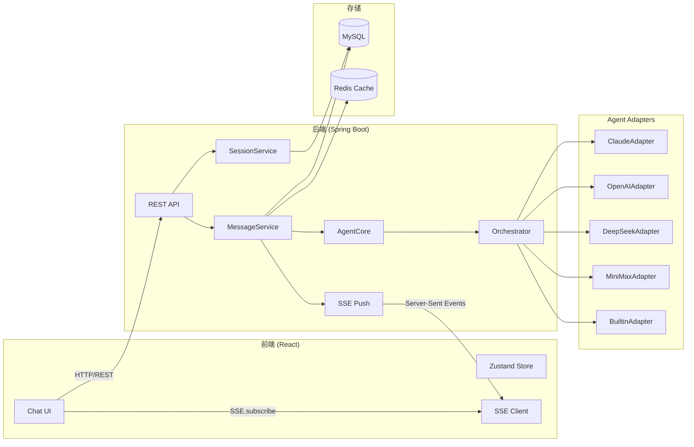
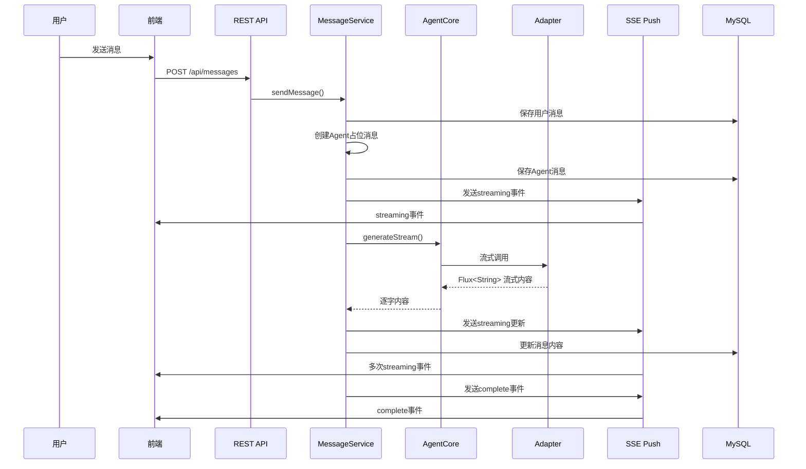
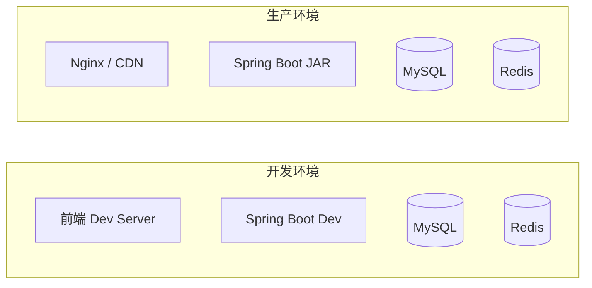

# SPEC_ARCHITECTURE.md

## 系统架构



---

## 组件职责

### 前端组件

| 组件 | 职责 |
|---|---|
| `ChatPage` | 聊天主页面，管理消息列表和输入 |
| `MessageList` | 消息列表渲染 |
| `MessageItem` | 单条消息渲染，支持Artifact卡片 |
| `SessionList` | 会话列表侧边栏 |
| `MessageInput` | 消息输入框，支持@提示 |
| `useSSE` | SSE连接和消息处理Hook |

### 后端服务

| 服务 | 职责 |
|---|---|
| `MessageService` | 消息发送、持久化、SSE推送 |
| `SessionService` | 会话管理（创建、列表、删除） |
| `AgentSessionService` | Agent任务会话管理 |
| `AgentCore` | Agent调度核心，根据Provider选择Adapter |
| `Orchestrator` | 多Agent任务编排和结果聚合 |

### Agent Adapters

| Adapter | 职责 |
|---|---|
| `DeepSeekAdapter` | DeepSeek API调用 |
| `MiniMaxAdapter` | MiniMax API调用 |
| `OpenAIAdapter` | OpenAI API调用 |
| `ClaudeAdapter` | Anthropic Claude API调用 |
| `BuiltinAgentAdapter` | 内置简单Agent（无API Key时使用） |

---

## 数据流

### 消息发送流程



### 多Agent调度流程

```mermaid
flowchart TD
    START[用户发送@消息] --> PARSE[解析@Agent列表]
    PARSE --> MODE{调度模式}
    MODE -->|单Agent| SINGLE[直接调用对应Adapter]
    MODE -->|多Agent| MULTI[依次调用多个Adapter]
    SINGLE --> RESP[返回响应]
    MULTI --> AGENT1[调用Agent1]
    AGENT1 --> AGENT2[调用Agent2]
    AGENT2 --> AGENT3[调用Agent3]
    AGENT3 --> AGGREGATE[Orchestrator聚合结果]
    AGGREGATE --> RESP
    RESP --> SSE_PUSH[SSE推送]
    SSE_PUSH --> END[前端渲染]
```

---

## 技术选型

| 层级 | 技术 | 说明 |
|---|---|---|
| 前端框架 | React 18 + Vite | 快速开发，热更新 |
| UI组件 | Tailwind CSS | 原子化CSS |
| 状态管理 | Zustand | 轻量级状态管理 |
| 后端框架 | Spring Boot 3.2 | Java主流框架 |
| ORM | MyBatis-Plus | MyBatis增强 |
| 数据库 | MySQL | 关系型数据存储 |
| 缓存 | Redis | 会话缓存，SSE连接管理 |
| HTTP客户端 | WebClient | 响应式HTTP调用 |
| 流式通信 | SSE | 服务端推送 |
| AI集成 | Adapter Pattern | 解耦AIProvider |

---

## 部署架构



---

## 安全考虑

| 安全点 | 实现方式 |
|---|---|
| 认证 | JWT Token |
| 授权 | 会话成员验证 |
| API防护 | 输入校验，SQL注入防护 |
| AI内容 | 用户消息脱敏，敏感信息过滤 |
| SSE连接 | Token验证 |
