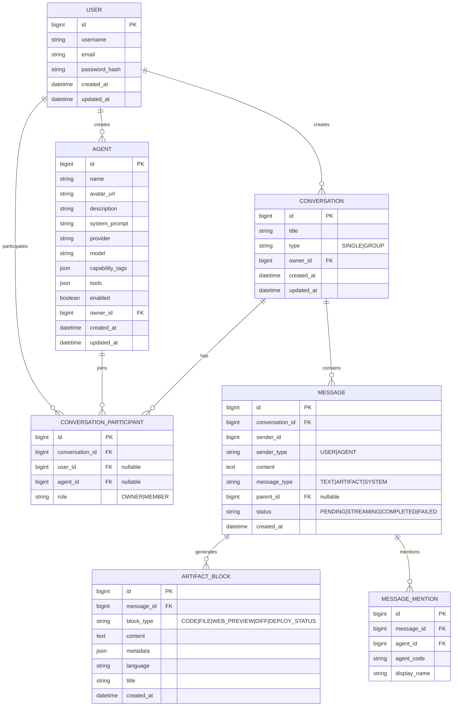

# SPEC_DATA_MODEL.md

## 概述

本文档描述 AgentHub 的核心数据模型，包括实体关系、字段说明和建模规范。

---

## 核心实体关系



---

## 数据表说明

### user 用户表

| 字段 | 类型 | 说明 |
|---|---|---|
| id | BIGINT | 主键 |
| username | VARCHAR(50) | 用户名，唯一 |
| email | VARCHAR(100) | 邮箱，唯一 |
| password_hash | VARCHAR(255) | 密码哈希 |
| created_at | DATETIME | 创建时间 |
| updated_at | DATETIME | 更新时间 |

### agent Agent表

| 字段 | 类型 | 说明 |
|---|---|---|
| id | BIGINT | 主键 |
| name | VARCHAR(100) | Agent名称 |
| avatar_url | VARCHAR(500) | 头像URL |
| description | TEXT | Agent描述 |
| system_prompt | TEXT | System Prompt |
| provider | VARCHAR(50) | AI Provider (DEEPSEEK/MINIMAX/OPENAI/ANTHROPIC) |
| model | VARCHAR(100) | 模型名称 |
| capability_tags | JSON | 能力标签数组 |
| tools | JSON | 可用工具列表 |
| enabled | BOOLEAN | 是否启用 |
| owner_id | BIGINT | 创建者用户ID |
| created_at | DATETIME | 创建时间 |
| updated_at | DATETIME | 更新时间 |

### conversation 会话表

| 字段 | 类型 | 说明 |
|---|---|---|
| id | BIGINT | 主键 |
| title | VARCHAR(200) | 会话标题 |
| type | VARCHAR(20) | SINGLE(单聊) / GROUP(群聊) |
| owner_id | BIGINT | 创建者用户ID |
| created_at | DATETIME | 创建时间 |
| updated_at | DATETIME | 更新时间 |

### conversation_participant 会话参与者表

| 字段 | 类型 | 说明 |
|---|---|---|
| id | BIGINT | 主键 |
| conversation_id | BIGINT | 会话ID，外键 |
| user_id | BIGINT | 用户ID（user或agent二选一） |
| agent_id | BIGINT | AgentID（user或agent二选一） |
| role | VARCHAR(20) | OWNER(创建者) / MEMBER(成员) |

**约束**: user_id 和 agent_id 至少有一个非空

### message 消息表

| 字段 | 类型 | 说明 |
|---|---|---|
| id | BIGINT | 主键 |
| conversation_id | BIGINT | 会话ID，外键 |
| sender_id | BIGINT | 发送者ID（user_id或agent_id） |
| sender_type | VARCHAR(20) | USER / AGENT |
| content | TEXT | 消息文本内容 |
| message_type | VARCHAR(20) | TEXT / ARTIFACT / SYSTEM |
| parent_id | BIGINT | 父消息ID（用于回复链） |
| status | VARCHAR(20) | PENDING / STREAMING / COMPLETED / FAILED |
| created_at | DATETIME | 创建时间 |

**索引**: `(conversation_id, created_at)` 复合索引用于消息查询

### artifact_block 产物块表

| 字段 | 类型 | 说明 |
|---|---|---|
| id | BIGINT | 主键 |
| message_id | BIGINT | 所属消息ID，外键 |
| block_type | VARCHAR(50) | CODE / FILE / WEB_PREVIEW / DIFF / DEPLOY_STATUS |
| content | TEXT | 块内容（代码/diff/文本） |
| metadata | JSON | 渲染元数据（语言/URL/标题等） |
| language | VARCHAR(50) | 代码语言 |
| title | VARCHAR(200) | 标题 |
| created_at | DATETIME | 创建时间 |

### message_mention @提及表

| 字段 | 类型 | 说明 |
|---|---|---|
| id | BIGINT | 主键 |
| message_id | BIGINT | 消息ID，外键 |
| agent_id | BIGINT | 被提及的Agent ID |
| agent_code | VARCHAR(100) | Agent代码 |
| display_name | VARCHAR(100) | 显示名称 |

---

## 建模规范

### AgentHub 数据建模约定

1. **content分离原则**
   - `message.content` 只存主要文本内容
   - `artifact_block.content` 存代码、diff、文本等块内容

2. **JSON字段使用**
   - `artifact_block.metadata` 存渲染需要的JSON数据
   - `agent.capability_tags` 和 `agent.tools` 使用JSON数组

3. **大字段策略**
   - 大文件内容不入库，只保存URL或storage key
   - 代码/diff内容使用TEXT类型

4. **消息查询规范**
   - 所有消息查询必须带 `conversation_id` 条件
   - 使用 `(conversation_id, created_at)` 复合索引

5. **外键约束**
   - 消息表 `conversation_id` 外键关联 conversation(id)
   - 删除会话前必须先删除关联消息
   - 使用 `@Transactional` 保证删除事务性

---

## 实体关系说明

### 会话与参与者

```
conversation (1) --- (N) conversation_participant
                                    |
                    +---------------+---------------+
                    |                               |
              user (nullable)                  agent (nullable)
```

- 单聊(SINGLE): 1个user + 1个agent
- 群聊(GROUP): 1个user(OWNER) + N个agent(MEMBER)

### 消息与产物

```
message (1) --- (N) artifact_block
```

- 一条消息可生成多个产物块
- 产物块依赖消息存在

### 提及与Agent

```
message (1) --- (N) message_mention --- (1) agent
```

- 一条消息可@多个Agent
- 提及用于Orchestrator解析调度目标
